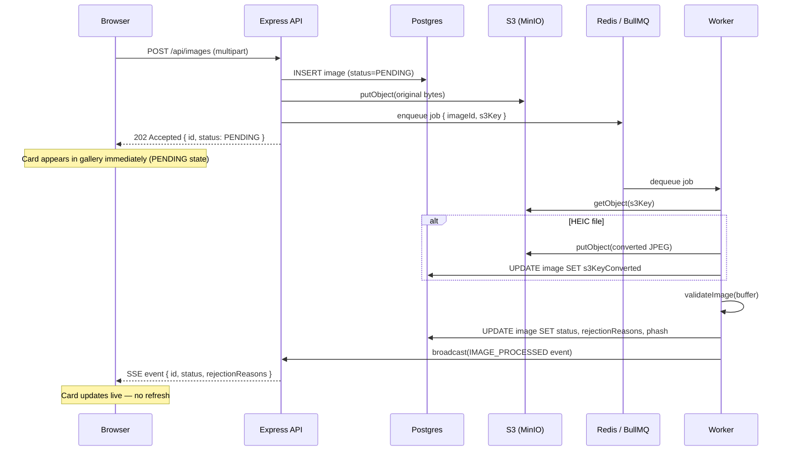
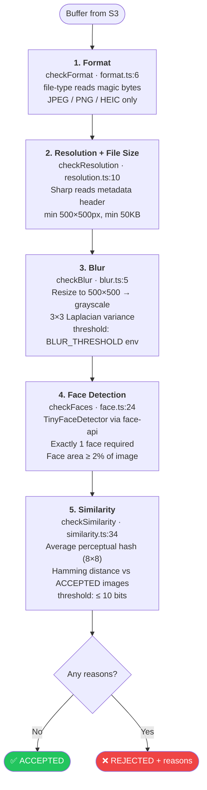
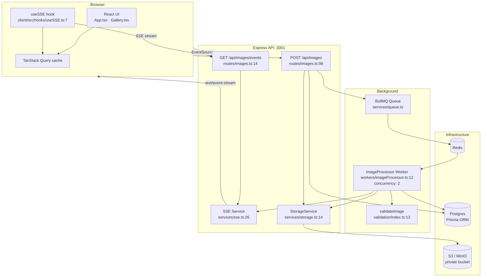
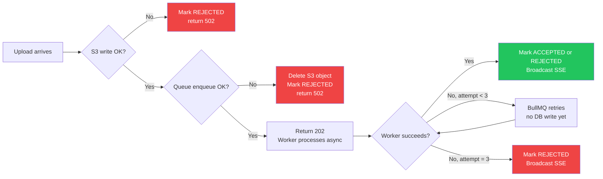

# Aragon Image Upload Pipeline — Architecture

## Request Flow

---

## Validation Pipeline

> All 5 checks always run — no fail-fast. Every rejection reason is returned at once.

---

## Component Map

---

## Failure Handling

---

## Key Design Decisions

| Decision | Why |
|---|---|
| 202 Accepted, not 200 | Work is queued, not complete — semantically correct |
| Run all 5 checks (no fail-fast) | User sees every rejection reason in one upload, not one per re-upload |
| Compare similarity vs ACCEPTED only | Two simultaneous duplicates: one passes, one rejects — correct behavior |
| Deferred REJECTED write (final retry only) | Prevents REJECTED → ACCEPTED SSE pair on retry success |
| Promise-based model load lock | Prevents double-load under worker concurrency ≥ 2 |
| Magic bytes over MIME type | MIME types can be spoofed by renaming; bytes cannot |
| Private S3 + presigned URLs | No public bucket, access auditable, URLs expire after 300s |
| MinIO in dev, S3 in prod | Same SDK, one env var difference — zero accidental AWS charges locally |
| All thresholds in env vars | Tunable per deployment without code change or redeploy |
| Resize to 500×500 before blur check | Scale-independent — same score for same focus level regardless of MP count |
