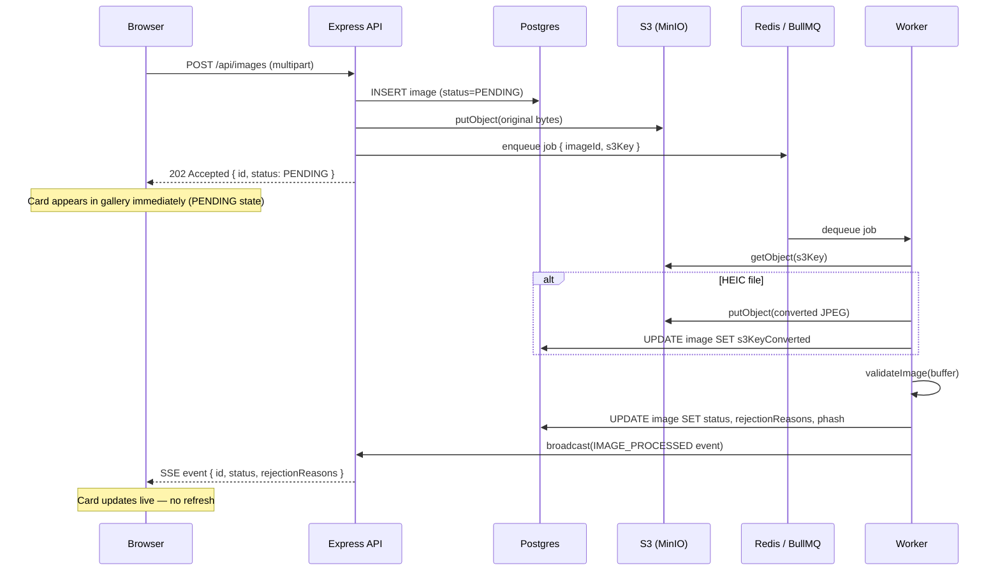
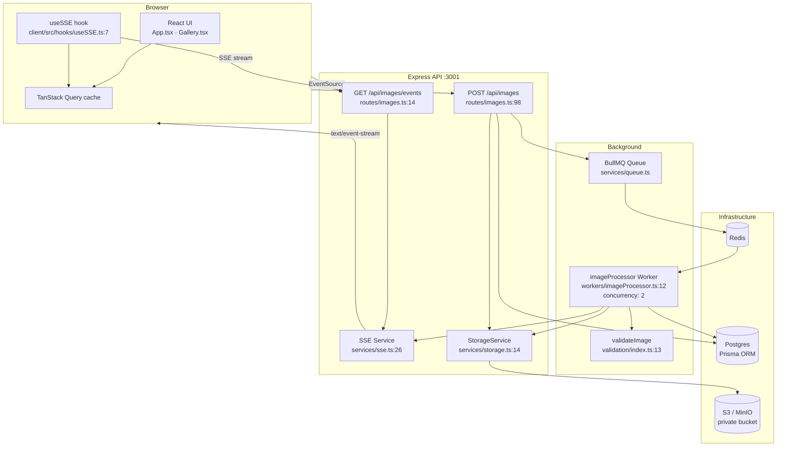
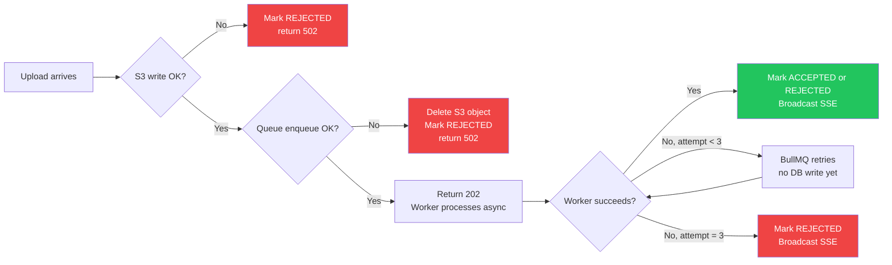
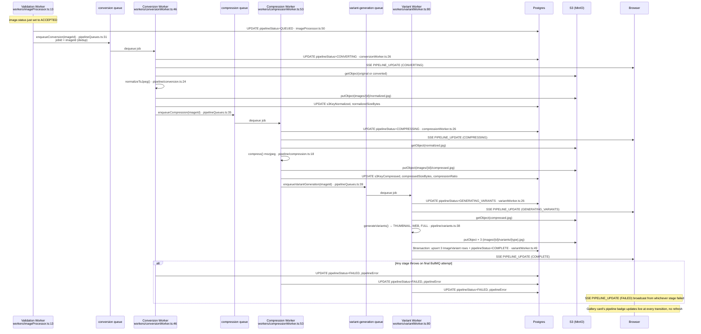
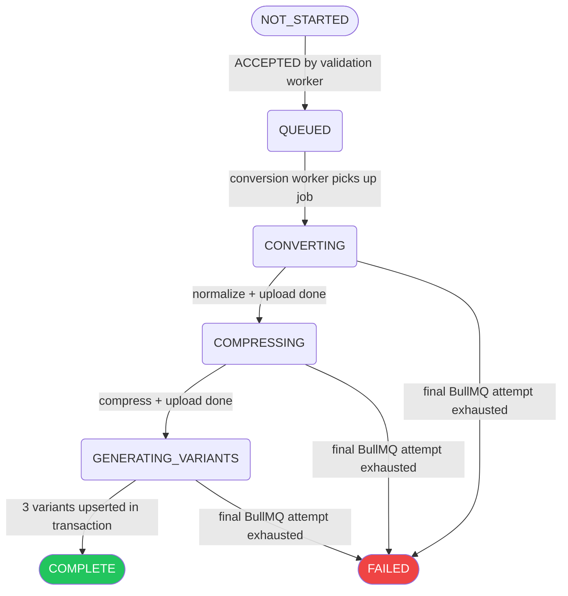

# Aragon Image Upload Pipeline — Architecture

## Request Flow



---

## Validation Pipeline


> All 5 checks always run — no fail-fast. Every rejection reason is returned at once.

---

## Component Map



---

## Failure Handling



---

## Key Design Decisions

| Decision | Why |
|---|---|
| 202 Accepted, not 200 | Work is queued, not complete — semantically correct |
| Run all 5 checks (no fail-fast) | User sees every rejection reason in one upload, not one per re-upload |
| Compare similarity vs ACCEPTED only | Two simultaneous duplicates: one passes, one rejects — correct behavior |
| Deferred REJECTED write (final retry only) | Prevents REJECTED → ACCEPTED SSE pair on retry success |
| Promise-based model load lock | Prevents double-load under worker concurrency ≥ 2 |
| Magic bytes over MIME type | MIME types can be spoofed by renaming; bytes cannot |
| Private S3 + presigned URLs | No public bucket, access auditable, URLs expire after 300s |
| MinIO in dev, S3 in prod | Same SDK, one env var difference — zero accidental AWS charges locally |
| All thresholds in env vars | Tunable per deployment without code change or redeploy |
| Resize to 500×500 before blur check | Scale-independent — same score for same focus level regardless of MP count |

---

# Part 2: Media Processing Pipeline

Once an image is `ACCEPTED` by the Part 1 validation pipeline, a second, independent pipeline normalizes, compresses, and generates display variants of it. This pipeline tracks its own `pipelineStatus` on the `Image` row, separate from the Part 1 `status` field.

## Pipeline Flow



## `PipelineStatus` State Machine



Each queue's `defaultJobOptions` sets `attempts: 3` with exponential backoff (`pipelineQueues.ts:8-13`). Only the final failed attempt writes `pipelineStatus: FAILED` — earlier attempts just retry, mirroring the Part 1 deferred-REJECTED-write pattern.

## Idempotency

Reprocessing the same `imageId` twice — whether from a manual re-enqueue, a BullMQ retry, or an operator replaying a job — cannot corrupt state or produce duplicate variants, for four concrete reasons:

- **Deterministic S3 keys**: every stage writes to a fixed key (`images/{id}/normalized.jpg`, `images/{id}/compressed.jpg`, `images/{id}/variants/{type}.jpg`). Re-running a stage simply overwrites the same object; there is no key that accumulates duplicates.
- **BullMQ `jobId: imageId` dedup**: `enqueueConversion`, `enqueueCompression`, and `enqueueVariantGeneration` all pass `{ jobId: imageId }` (`pipelineQueues.ts:31,35,39`). BullMQ refuses to add a second job with a jobId already active/waiting in the same queue, so a duplicate enqueue call is a no-op rather than a second execution.
- **`ImageVariant` upsert on `@@unique([imageId, type])`**: the variant worker's final write is `prisma.imageVariant.upsert({ where: { imageId_type: { imageId, type } }, ... })` inside a `$transaction` (`variantWorker.ts:49-75`). Re-running variant generation updates the existing THUMBNAIL/WEB/FULL rows in place rather than inserting new ones.
- **`pipelineStatus === 'COMPLETE'` skip-guard**: every worker's entry point (`processConversionJob`, `processCompressionJob`, `processVariantJob`) checks `if (image.pipelineStatus === 'COMPLETE') return` before doing any work (`conversionWorker.ts:19`, `compressionWorker.ts:19`, `variantWorker.ts:19`). Once an image finishes the pipeline, any stray or replayed job for it is a cheap no-op.

Together these mean the pipeline is safe to retry, replay, or scale out without a distributed lock: the worst case for a race between two workers on the same `imageId` is redundant S3 writes to the same key, not duplicate rows or corrupted state.

## Service Topology & Scaling

`docker-compose.yml` defines five containerized services for the pipeline, in addition to `postgres`, `redis`, `minio`, and `minio-init`:

| Service | Entrypoint |
|---|---|
| `api` | `server/Dockerfile` default (Express app) |
| `validation-worker` | `node dist/workers/validationWorker.js` |
| `conversion-worker` | `node dist/workers/conversionWorker.js` |
| `compression-worker` | `node dist/workers/compressionWorker.js` |
| `variant-worker` | `node dist/workers/variantWorker.js` |

Each pipeline worker is **stateless**: the BullMQ job payload is just `{ imageId }` (`pipelineQueues.ts:4-6`), and every other piece of state — pipeline stage, S3 keys, byte sizes, variant rows — lives in Postgres or S3, not in worker memory. This means any number of replicas of a given worker can safely consume from the same queue.

Scale the CPU/IO-heavy stages horizontally with:

```bash
docker compose up -d --scale conversion-worker=4 --scale compression-worker=4 --scale variant-worker=4
```

This works because none of the four worker services declare a `container_name` (unlike `postgres`/`redis`/`minio`/`minio-init`, which are pinned to single instances) — Compose is free to create N containers per service name, and since the workers hold no in-memory state, BullMQ's Redis-backed queue safely distributes jobs across however many replicas are running.

The `api` service additionally overrides `S3_PUBLIC_ENDPOINT: http://localhost:9000` in `docker-compose.yml`, on top of whatever `.env` sets — this is what fixes presigned URLs handed to the browser: `S3_ENDPOINT` inside the compose network is `http://minio:9000`, which only containers can resolve, so the API's public-facing endpoint is pinned separately to the host-published port that a browser or host CLI tool can actually reach.

## Key Design Decisions (Part 2)

| Decision | Why |
|---|---|
| Three separate queues/workers, not one | Conversion, compression, and variant generation have different CPU/IO cost profiles — splitting them lets each stage scale independently instead of over- or under-provisioning a single worker pool |
| `pipelineStatus` is a separate column/track from `status` | Keeps Part 1's validation semantics (`PENDING`/`ACCEPTED`/`REJECTED`) untouched — the media pipeline is purely additive and only ever starts after `status` is already `ACCEPTED` |
| `LOAD_TEST_MODE` bypasses only face + similarity checks | Format, resolution, and blur checks still run on synthetic load-test images, keeping the load test representative of real file-handling cost; face and similarity checks are skipped because synthetic images can't satisfy "exactly one face" or meaningful perceptual-hash comparisons |
